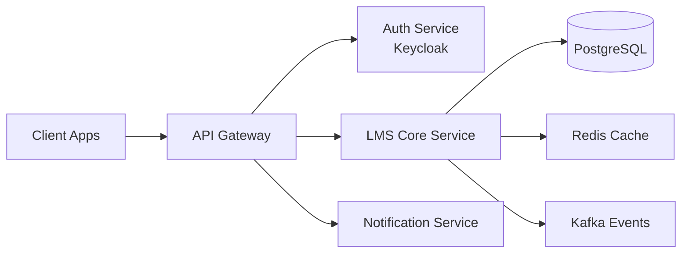

<div align="center">


<br/>

<a href="mailto:hoangtm2511.work@gmail.com">

</a>

<a href="https://linkedin.com/in/hoangtm2511">

</a>

</div>

---

# ⚡ About Me

```yaml
name: Hoang Truong Minh
role: Backend Engineer
location: Vietnam

focus:
  - Scalable Backend Systems
  - Microservices Architecture
  - Authentication & Authorization
  - Event-Driven Systems
  - Clean Architecture

currently_building:
  - LMS Platform
  - Multi-Tenant SaaS Backend
```

---

# 🧠 Engineering Focus

<div align="center">



</div>

---

# 🛠 Tech Stack

<div align="center">

### Backend Core


### Data & Messaging


### DevOps & Infrastructure


</div>

---

# 🚀 Featured Projects

<table>
<tr>
<td width="50%">

### 🎓 LMS Platform

Multi-tenant Learning Management System

**Tech:**
`Spring Boot` `PostgreSQL`
`Keycloak` `Docker`

Features:
- Authentication & RBAC
- Attendance & Exams
- Assignment Management
- Multi-role Architecture

</td>

<td width="50%">

### ⚙️ Auth & Identity

Modern authentication platform

**Tech:**
`Keycloakify`
`OIDC`
`JWT`

Features:
- Custom Login Theme
- RBAC
- SSO Ready
- Secure Token Flow

</td>
</tr>
</table>

---

# 📈 GitHub Analytics

<div align="center">


<br/>


</div>

---

<div align="center">

### ⚡ Building systems that scale, not just apps.

</div>
